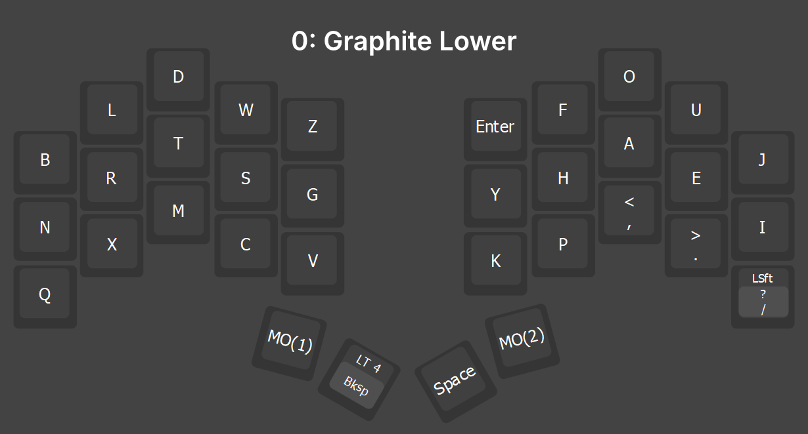
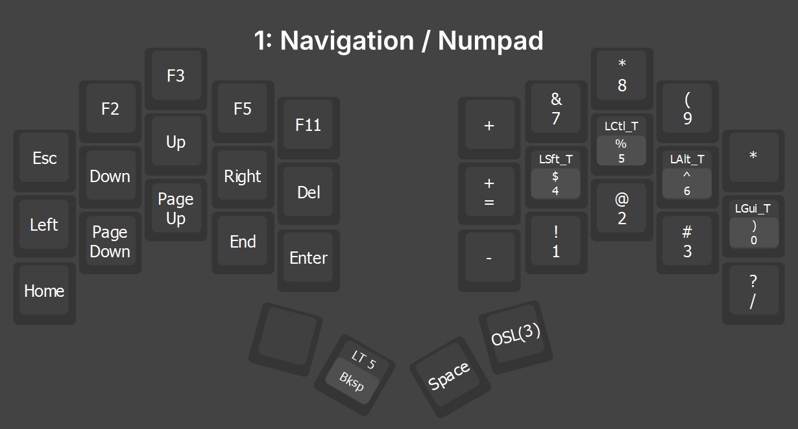
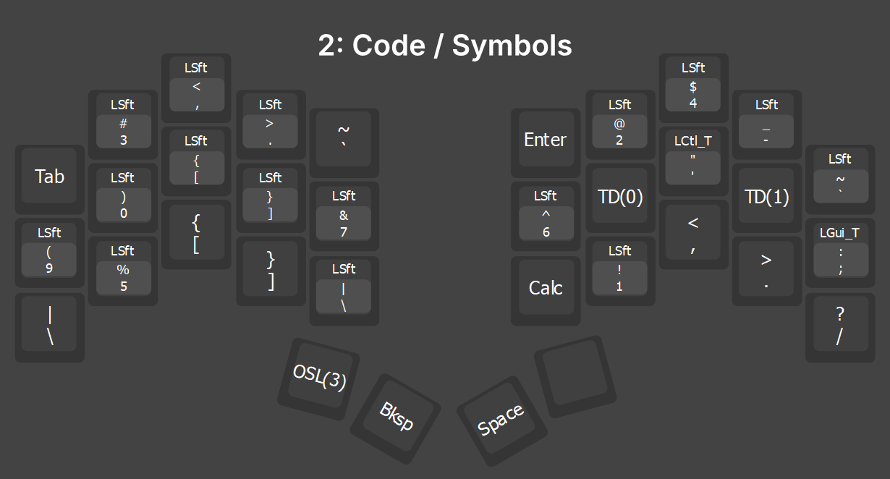
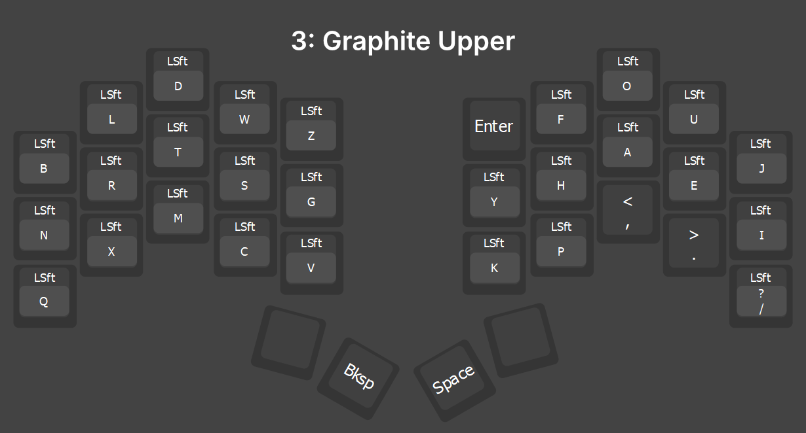
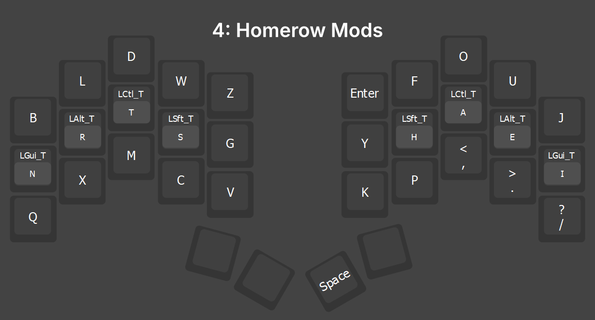
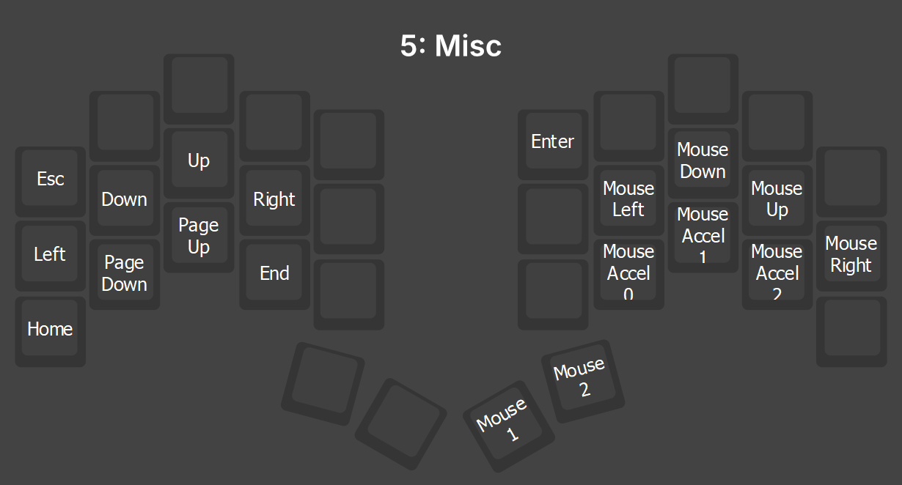

# Graphite Code

I use my 34 key [Crab Broom (Choc Ferris Sweep)](https://www.boardsource.xyz/products/crab-broom) daily for full-time programming in C, Lua, TypeScript, and C#. This keymap has been optimized for coding and comfort.

After using my 42 key [Unicorne Keymap](https://github.com/frankprogrammer/qmk_userspace) I realized that putting modifiers on the outer columns just made things very hard to use and that Home Row Mods were the solution.

[Home Row Mods](https://precondition.github.io/home-row-mods) are amazing but they also introduce issues like firing by accident and adding a slight delay to the keys they are on. This delay drove me insane and so the perfect solution was to just put them on seperate layer that was easily accessible.

[Download my Vial saved layout](ferris-sweep-vial.vil) - Requires downloading the Vial app

## 0: Graphite Lower

I use the [Graphite keyboard layout](https://github.com/rdavison/graphite-layout). I originally used Colemak DH, which was a massive improvement over QWERTY, but still had some awkward combinations. Graphite has a more balanced hand and finger usage than Colemak and it feels like it has some nice rolls in it too.

I felt that having **C** and **V** on the left hand was important so that I can copy and paste while using the mouse. 

The **MO(1)** and **MO(2)** keys will change layers to [Navigation](#1-navigation--numpad) or [Code](#2-code--symbols) while held individually.

The **Backspace** key is triggered when tapped or if tapped and then held. If held without tapping, it triggers the [Home Row Mods layer](#4-homerow-mods). The Layer Tap functionallity delay is not an issue on the **Backspace** key, but it is noticeable if you use it on the **Space** key.

## 1: Navigation / Numpad

When using a split keyboard, it is important that all of the navigation keys are on the side opposite the mouse. This allows me to click code with my right hand and navigate it with my left at the same time. 

I also put **Enter** on the left half for rare cases when I need to press it while my right hand is on the mouse.

Pressing the **OSL(3)** thumb key on the right (at this point I am still holding the left layer key) will toggle the [Uppercase layer](#3-graphite-upper). I can let go of both thumb keys and type a single uppercase letter or hold both to continue typing in uppercase.

This layer also includes Home Row Mods on the right half to use mainly with the arrow keys but also for common combos like **Ctrl +** and **Ctrl -**.

## 2: Code / Symbols

The 8 symbols on the homerow locations are my most used coding symbols.

QMK does not allow you to use the Mod Tap functiallity on Shifted keys, but I was able to implement the Home Row Mods using Tap Dance.

**TD(0)** is defined in Vial as **"** on tap and **Shift** on Hold. **TD(1)** is definded as **:** on tap and **Alt** on hold. You could mirror this functionlity on the left side if needed.

This results in the home row being (){}&  ^"':;

Pressing the **OSL(3)** thumb key on the left (at this point I am still holding the right layer key) will toggle the Uppercase layer. I can let go of both thumb keys and type a single uppercase letter or hold both to continue typing in uppercase.

## 3: Graphite Upper

Keeping the uppercase letters on a separate layer triggered by the thumbs allows me to touch type as normal since I don't have to dance around with which Home Row Mod key to trigger.

## 4: Homerow Mods

The main feature that allowed me to go from 42 keys down to 34 was Home Row Mods. The huge bonus was that it made using modifiers way easier

## 5: Misc

I do not actually use this layer, but I wanted do include a layer where I think you could put any extra random things.

## Firmware

If you own a wired keyboard, then [Vial](https://get.vial.today/) is a must-have. I wasted so much time tweaking the QMK firmware myself and then using VIA. You can configure a lot of the QMK settings from within Vial instantly and you don't need to manually type key codes like in VIA.

## Hardware

- [Crab Broom (Choc Ferris Sweep)](https://www.boardsource.xyz/products/crab-broom)

- [Ambient Silent Nocturnal Switches](https://lowprokb.ca/products/ambients-silent-choc-switches?variant=44873446391972) - These are 20G Linear switches that feel amazing and are ultra silent. I used Purpz (25G Linear) and Pinks (20G Linear) before this.

- [Chosfox Keycaps](https://www.amazon.com/dp/B0CP28G897)

- [UGREEN MagSafe Stand](https://www.amazon.com/dp/B0CMHT5LZ5) - Comes with MagSafe sticker to attach to the back of your keyboard. Extremely strong, I use this for my iPad with no worries or movement. I tent everything at 45 degrees (Use the Measure app on your phone to level this).

- [90 degree TRRS Cable](https://www.amazon.com/dp/B0C7P6VHZM)

- [Apple Magic Trackpad](https://www.amazon.com/dp/B0DL6L6HPG) - I have tried every conceivable type of "mouse" and this is the only thing that doesn't hurt after longterm use. Tented at 45 degrees of course.

## Resources

- [Vial](https://get.vial.today/)

- [What makes a keyboard layout good?](https://semilin.github.io/blog/2023/layout_quality.html)

- [Keyboard layout family tree](https://www.reddit.com/r/KeyboardLayouts/comments/11g3xlx/keyboard_layout_family_tree/)

- [Oxey's Layouts](https://oxey.dev/index.html)

- [The QMK Tutorial](https://docs.qmk.fm/#/newbs)

- [KeyBR](https://www.keybr.com/) - The best site for learning a new layout

- [MonkeyType](https://monkeytype.com/) 

- [SpeedTyper.dev](https://speedtyper.dev/)